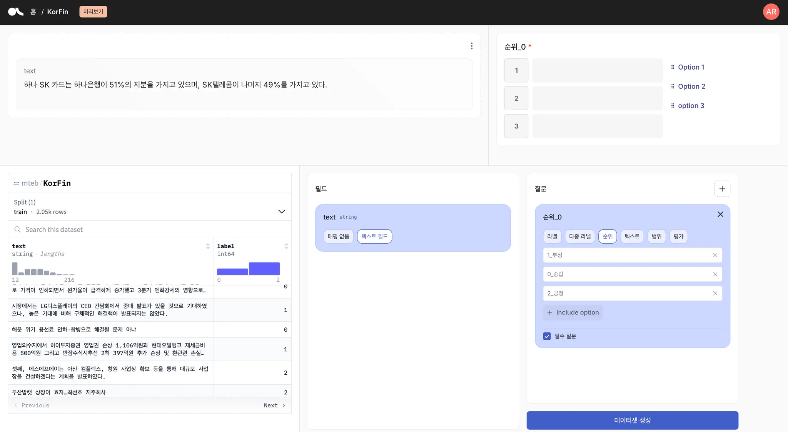
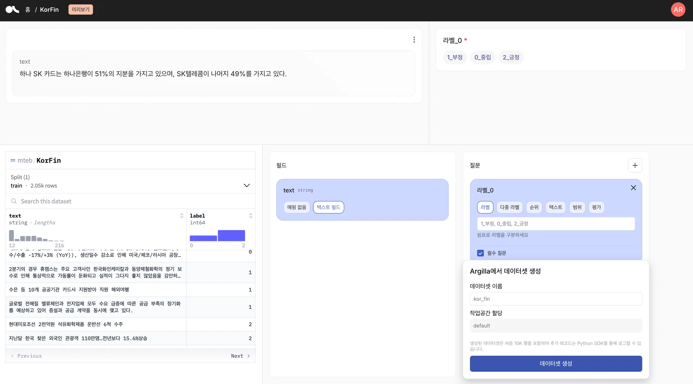
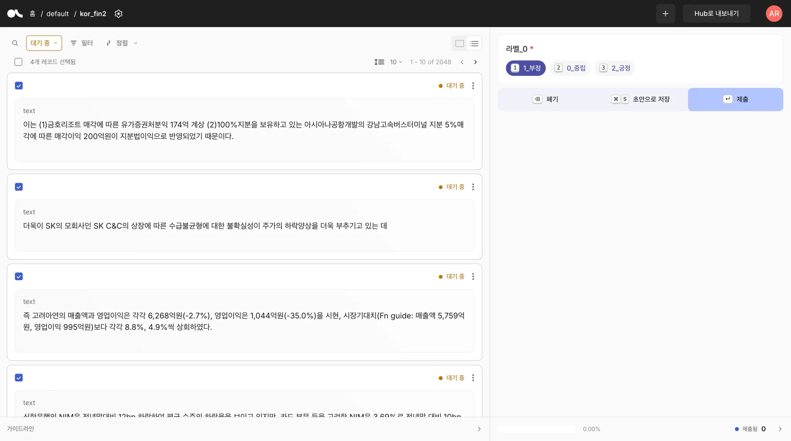
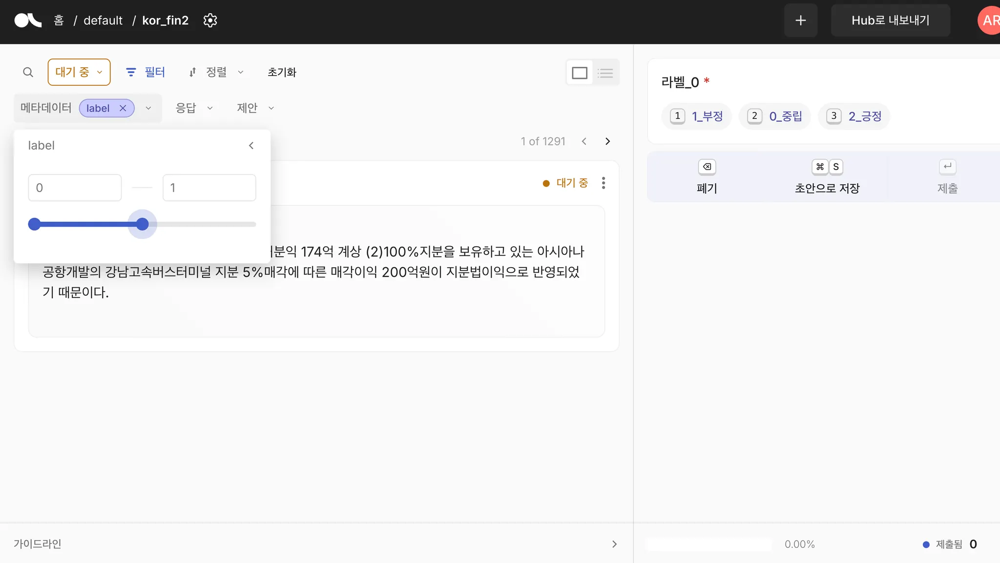
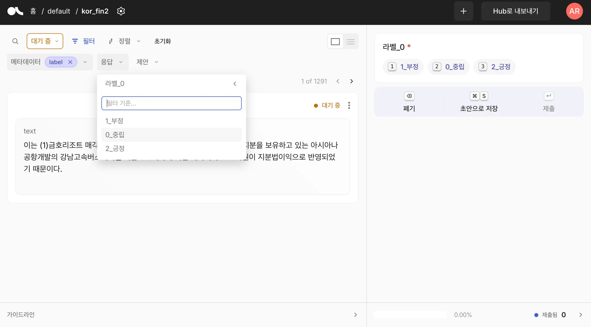

# Argilla 한국어 지원 프로젝트

## 📌 개요

Argilla 데이터 주석 플랫폼에 **완벽한 한국어 지원**을 추가한 프로젝트입니다. 
모든 UI 요소, 라벨, 메시지를 한국어로 번역했으며, 한국어를 기본 언어로 설정했습니다.

## ✅ 완료된 작업

### 1. 🌐 한국어 UI 번역
- ✅ **400개 이상**의 UI 문자열을 한국어로 번역
- ✅ 메뉴, 버튼, 메시지, 도움말 등 모든 인터페이스 요소 번역
- ✅ 한국어를 기본 언어(defaultLocale)로 설정
- ✅ 언어 선택 메뉴에 "한국어" 옵션 추가

### 2. 🏷️ 라벨 한국어 지원
- ✅ 데이터 라벨(pos, neg, neutral 등)의 자동 한국어 변환
- ✅ 주석 작업 시 라벨이 한국어로 표시 (긍정, 부정, 중립 등)
- ✅ 필터 및 검색에서도 한국어 라벨 지원

### 3. 🐳 Docker 배포
- ✅ Docker Compose를 통한 완전한 스택 배포
- ✅ PostgreSQL, Elasticsearch, Redis 통합
- ✅ 볼륨 마운트를 통한 한국어 프론트엔드 제공
- ✅ 한국어 UI가 적용된 상태로 즉시 사용 가능

### 4. 🛠️ CLI 도구 개발
- ✅ 데이터 백업 도구 (`backup_argilla_db.sh`)
- ✅ JSONL 내보내기 도구 (`export_to_jsonl_v2.py`)
- ✅ 완전한 데이터 추출 도구 (`export_argilla_data.py`)

## 🖼️ 스크린샷

### 로그인 화면

*한국어로 번역된 로그인 화면*

### 데이터셋 목록

*한국어 UI가 적용된 데이터셋 목록*

### 주석 작업 화면

*한국어 라벨과 UI가 적용된 주석 작업 화면*

### 언어 선택 메뉴

*한국어가 추가된 언어 선택 메뉴*

### 설정 화면

*완전히 한국어로 번역된 설정 화면*

## 📂 프로젝트 구조

```
argilla-korean/
├── argilla-frontend/       # 프론트엔드 (한국어 번역 포함)
│   ├── translation/
│   │   └── ko.js          # 한국어 번역 파일
│   └── nuxt.config.ts     # 한국어 설정
├── argilla_cli/           # CLI 도구
│   ├── backup_argilla_db.sh        # DB 백업
│   ├── export_to_jsonl_v2.py       # JSONL 내보내기
│   └── export_argilla_data.py      # 데이터 추출
├── docker-compose.yaml    # Docker 설정
└── README_KOR.md         # 이 문서
```

## 🚀 시작하기

### 1. 저장소 클론
```bash
git clone https://github.com/hongsw/argilla-korean.git
cd argilla-korean
```

### 2. Docker Compose 실행
```bash
docker compose up -d
```

### 3. 접속
브라우저에서 http://localhost:6900 접속
- 사용자명: argilla
- 비밀번호: 12345678

## 💾 데이터 관리 도구

### 1. 데이터베이스 백업
```bash
cd argilla_cli
./backup_argilla_db.sh
```
- PostgreSQL 전체 데이터를 SQL 덤프로 백업
- 자동 압축 (gzip)
- 타임스탬프가 포함된 파일명

### 2. JSONL 형식으로 데이터 내보내기
```bash
cd argilla_cli
python export_to_jsonl_v2.py
```

**실행 결과 예시:**
```
📥 데이터셋 'kor_fin2' 추출 시작 (v2)...
✅ JSONL 파일 생성 완료: kor_fin2_20251015_2.jsonl
📊 총 2048개 레코드 저장됨
📦 파일 크기: 1050.22 KB

📊 라벨 통계:
  - 2_긍정: 1984개
  - 1_부정: 35개
  - 0_중립: 29개
```

**JSONL 데이터 구조:**
```json
{
  "id": "000f540d-f3ba-46b6-a362-0282c0d2a75c",
  "text": "NH투자: 포스코케미칼 2차전지 소재 급성장 기대",
  "label": "2_긍정",
  "metadata": {"label": 1},
  "status": "completed",
  "created_at": "2025-10-15T06:49:21.014301",
  "updated_at": "2025-10-15T06:54:59.044193",
  "annotator": "46d7b604-f800-43a0-8b6a-3597d7798b77",
  "annotation_date": "2025-10-15T06:54:59.041067",
  "response_status": "submitted"
}
```

### 3. 다양한 형식으로 내보내기 (JSON/CSV)
```bash
cd argilla_cli
python export_argilla_data.py
```
- JSON 및 CSV 형식 동시 지원
- 모든 데이터셋 또는 특정 데이터셋 선택 가능
- 메타데이터, 응답, 제안 등 모든 정보 포함

## 🔧 기술 스택

- **Frontend**: Nuxt.js, Vue.js
- **Backend**: Python, FastAPI
- **Database**: PostgreSQL
- **Search**: Elasticsearch
- **Cache**: Redis
- **Container**: Docker, Docker Compose

## 📝 번역 상세

### 번역된 주요 섹션
- ✅ 네비게이션 메뉴
- ✅ 데이터셋 관리
- ✅ 주석 작업 인터페이스
- ✅ 사용자 설정
- ✅ 에러 메시지
- ✅ 도움말 및 가이드
- ✅ 통계 및 진행률
- ✅ 필터 및 검색
- ✅ 단축키 안내

### 라벨 번역 매핑
```javascript
labelTranslations: {
    pos: "긍정",
    positive: "긍정",
    neg: "부정",
    negative: "부정",
    neutral: "중립",
    // ... 더 많은 라벨 번역
}
```

## 🎯 검증 완료 사항

### UI/UX 검증
- ✅ 모든 메뉴가 한국어로 정상 표시
- ✅ 버튼, 툴팁, 플레이스홀더 한국어 확인
- ✅ 반응형 디자인에서도 한국어 깨짐 없음
- ✅ 한국어 폰트 렌더링 정상

### 기능 검증
- ✅ 데이터셋 생성/수정/삭제 정상 작동
- ✅ 주석 작업 및 저장 정상
- ✅ 필터링 및 검색 한국어 지원
- ✅ 데이터 내보내기 정상 작동
- ✅ 백업 및 복원 테스트 완료

### 데이터 무결성
- ✅ 한국어 라벨이 정확히 저장됨
- ✅ UTF-8 인코딩으로 한글 깨짐 없음
- ✅ JSONL 내보내기 시 한국어 보존
- ✅ 데이터베이스 백업/복원 정상

## 📊 성과

- **번역 문자열**: 400+ 개
- **지원 라벨**: 25+ 종류
- **테스트 데이터셋**: 4개
- **처리 레코드**: 2,048개
- **내보내기 형식**: JSON, JSONL, CSV, SQL

## 🤝 기여

이 프로젝트는 오픈소스입니다. 기여를 환영합니다!

1. Fork the Project
2. Create your Feature Branch (`git checkout -b feature/AmazingFeature`)
3. Commit your Changes (`git commit -m 'Add some AmazingFeature'`)
4. Push to the Branch (`git push origin feature/AmazingFeature`)
5. Open a Pull Request

## 📄 라이선스

이 프로젝트는 Apache 2.0 라이선스를 따릅니다.

## 🙏 감사의 글

- [Argilla](https://github.com/argilla-io/argilla) 팀에게 감사드립니다
- 한국어 번역 검토에 도움을 주신 모든 분들께 감사드립니다

---

**개발자**: Hong Martin  
**날짜**: 2024년 10월 15일  
**버전**: 1.0.0